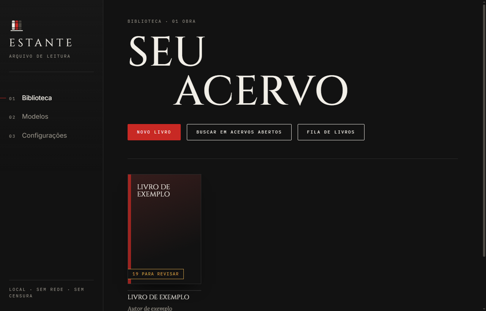
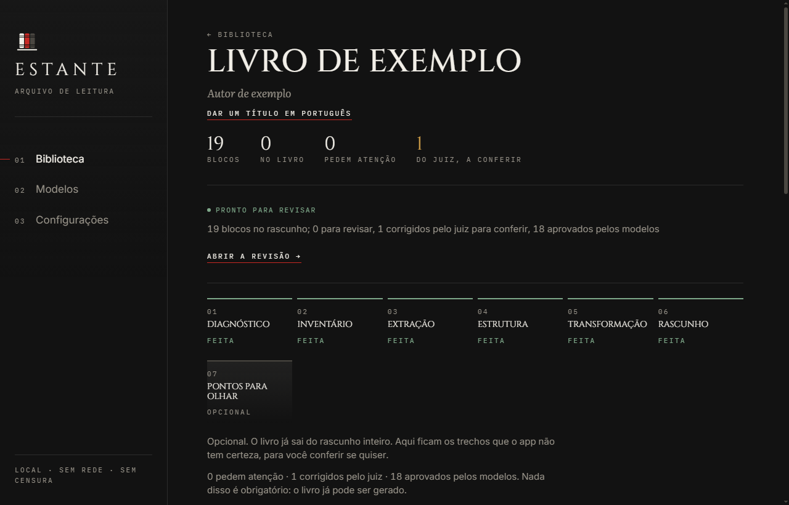
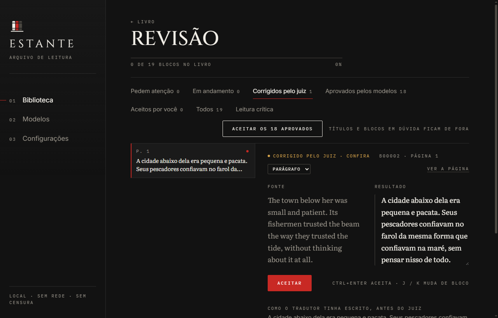
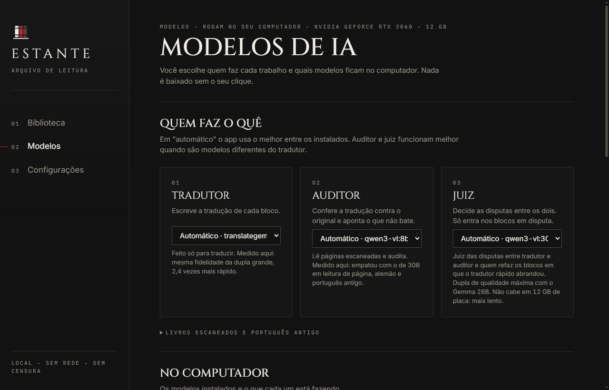

<p align="center">
  
</p>

<h1 align="center">Estante</h1>

<p align="center">
  <b>Leia livros em outras línguas, no seu computador, sem enviar nada para a nuvem.</b><br>
  O app traduz e atualiza o texto com modelos de IA que rodam na sua máquina. Você confere o que quiser e gera o livro em EPUB, PDF ou Word.
</p>



---

## O que ele faz

- **Lê** PDF (texto ou scan), EPUB e outros formatos.
- **Traduz** do inglês e do alemão para o português, e atualiza a grafia do português antigo.
- **Confere** cada bloco com um segundo modelo. Omissão, acréscimo, número trocado, "não" perdido ou trecho deixado no idioma original aparecem como alerta.
- **Mostra a fonte e a tradução lado a lado.** Você aceita o que quiser. O que o app não tem certeza fica destacado.
- **Gera** EPUB, PDF, Word e HTML, e também edições bilíngues.
- **Guarda o histórico** de cada aceite (git), dentro da sua biblioteca.





## Como funciona

Cada livro passa por sete etapas: **diagnóstico**, **inventário**, **extração** (com OCR quando é scan), **estrutura**, **transformação** (tradução e conferência), **rascunho** e **revisão**. A revisão é opcional: o app já sai com um texto completo, e você decide o que olhar.

O texto aprovado fica em um arquivo Markdown comum (`texto/livro.md`). As saídas (EPUB, PDF, Word) são geradas a partir dele com o Pandoc.

## Privacidade

- Sem conta, sem login, sem telemetria.
- Os livros e os textos não saem do computador.
- A única conexão é o **download dos modelos**, na primeira vez, direto do Hugging Face. Cada arquivo é conferido por SHA-256 antes de ser usado.
- Buscas em acervos abertos e o uso de um modelo pela internet vêm **desligados**. Você liga em Configurações, se quiser.

## Requisitos

- Windows 10 ou 11, 64 bits.
- Placa NVIDIA com 12 GB de memória. O app foi testado numa RTX 3060 de 12 GB.
- Sem placa, ele roda no processador, mais devagar. Esse caso não foi medido.
- Espaço: cerca de 15 GB para os três modelos padrão; cerca de 55 GB com todos.

Na RTX 3060, com a dupla padrão (tradução e auditoria), o fluxo completo levou cerca de **13 segundos por mil caracteres** do texto original, incluindo a troca de modelos. Foi medido em 60 parágrafos de texto.

## Instalação

### Para usar

1. Nesta página, clique em **Code** e depois em **Download ZIP**. Extraia a pasta onde quiser (ela é o programa: não apague depois).
2. Abra a pasta e dê dois cliques em `instalar.bat`. O instalador mostra o que falta no computador (Python, Git, Pandoc), instala pelo winget do próprio Windows, baixa o motor de IA (llama.cpp) e cria o atalho **Estante** na área de trabalho.
3. O app abre numa janela própria. Vá em **Modelos** e baixe os modelos; os três padrões somam cerca de 13 GB.

Se o instalador disser que algum passo não terminou, feche e abra o `instalar.bat` de novo: ele continua de onde parou.

### Para desenvolver (a partir do código)

Requisitos: Windows, Python 3.12, Git e Node.js 20 ou mais novo.

```bash
git clone https://github.com/kaymitow/Estante.git
cd Estante
instalar.bat        # instala o que faltar, baixa o motor de IA, cria o atalho e abre o app
```

Para compilar a interface: `cd app/ui`, depois `npm install` e `npx vite build`.

Para gerar o instalador: `cd desktop`, depois `npm install` e `npm run pacote`. O comando baixa o llama.cpp do repositório oficial e confere o SHA-256 antes de usar.

Para rodar os testes: `python app/testes.py`. O teste de aceite na revisão pede o app aberto na porta 8765.

## Como usar

1. **Novo livro**: importe um PDF ou um EPUB.
2. **Processar**: o app roda as etapas e mostra o trabalho ao vivo.
3. **Revisão**: confira o que quiser. A aba *Pedem atenção* reúne o que merece um olhar.
4. **Gerar**: escolha EPUB, PDF, Word, HTML ou a edição bilíngue.

Use só livros que você tem direito de usar. O app não traz livros nem modelos.



## Modelos

| Modelo | Faz o quê | Tamanho | Licença |
|---|---|---:|---|
| translategemma 12B | tradução | 7,3 GB | Gemma (Google) |
| Qwen3-VL 8B | auditoria e leitura de páginas escaneadas | 6,2 GB | Apache 2.0 |
| GLM-OCR | segundo leitor de páginas escaneadas | 1,4 GB | ver a página do modelo |
| Gemma 4 26B | auditor mais rigoroso (lento em 12 GB) | 18,1 GB | Apache 2.0 |
| Qwen3-VL 30B-A3B | juiz das disputas (lento em 12 GB) | 19,6 GB | Apache 2.0 |

Cada modelo mantém a licença dele. Os arquivos não fazem parte deste repositório.

## Limites

- **A tradução é feita por IA e pode errar.** O app marca o que desconfia, mas não garante fidelidade. Para publicar um livro, leia o resultado.
- **Só Windows, por enquanto.**
- **Scans dependem da qualidade da imagem.** Páginas borradas ou tortas geram erros de leitura.

## Princípios

- **Local.** O processamento acontece na sua máquina.
- **Sem censura.** O app não tem lista de temas proibidos. Se um modelo recusar ou amenizar um trecho, isso aparece como alerta para você decidir.
- **Fiel ao autor.** Cada bloco da tradução vem de um bloco do original. Nada é inventado para preencher lacunas.
- **A IA só sugere.** Nada entra no texto sem o seu aceite.

## Estrutura

```
app/          servidor (FastAPI), pipeline, motor de IA (llama.cpp) e a interface em app/ui (Svelte)
desktop/      o programa para Windows (Electron, com Python embutido)
ferramentas/  geração de EPUB e PDF, ortografia, busca e conferência
```

## Licença

GPL-3.0. Veja o arquivo [LICENSE](LICENSE).
